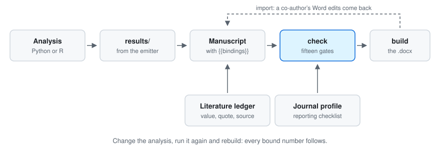
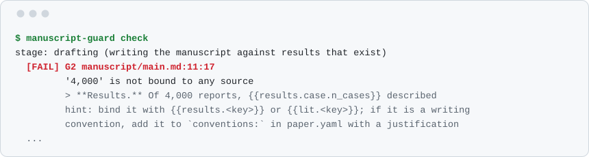

# manuscript-guard

[](https://github.com/BasileChretien/manuscript-guard/actions/workflows/ci.yml)
[](pyproject.toml)
[](LICENSE)
[](#status)

**Make every number in a scientific manuscript traceable to its source.**

A number in a paper comes from one of three places: your results, the literature, or a
convention of scientific writing. `manuscript-guard` holds a manuscript to that. Numbers
from your analysis are bindings into a results file that your code writes, numbers from the
literature are bindings into a ledger backed by stored sources, and anything else has to be
justified. Change the analysis, run it again and rebuild, and every bound number in the
manuscript and the supplement follows. A number with no source is a finding of the check,
not something left for a reviewer to notice.

<picture>
  <source media="(prefers-color-scheme: dark)" srcset="docs/img/loop-dark.svg">
  
</picture>

It is a command line tool written in Python, for a manuscript written in Markdown and built
to a Word document. The checks are deterministic code: they run offline and in CI and give
the same answer every time. No gate asks a model anything. Two of them read a recorded
review, of each figure and of the manuscript, which a person or a model may have written:
the record is what the gate reads, and a person answers its major findings
([principles](docs/principles.md)). Skills and hooks for Claude Code, Codex and other agent
tools are optional, and help with the parts that need judgement.

## What it catches

Each row names the stage from which its finding fails the run. Before that stage the
finding is printed and counted, and the run passes: a new project starts at `design`,
where the manuscript can wait ([stages](docs/stages.md)).

| What went wrong | What `check` names | Fails from |
|---|---|---|
| A number was typed into the text where a result should be bound | the number, with its line and column | `drafting` |
| A results file was edited by hand | the file, which no longer matches what the analysis wrote | `analysis` |
| The script that wrote a results file, or an input it declared, changed afterwards | which of them, and the script to run again | `analysis` |
| A value taken from a paper is not in the sentence quoted as evidence for it | the value and the quote; the quote itself has to be in the stored source | `drafting` |
| A number was typed into text that a figure draws | the line of the figure's script | `drafting` |
| The analysis changed after the Methods were last read against it | the files that changed | `internal-review` |
| A reporting checklist item (STROBE, CONSORT, PRISMA and others) is not addressed | each item still open | `internal-review` |
| The journal's word limit, a required section or a required statement is missed | which one | `internal-review` |
| A reply to a reviewer claims a revision that was not made | the point | `submission` |
| A number sits in TeX that Word would silently drop | the piece of TeX and its line, where pandoc is installed; `build` refuses it too | `drafting` |

`check` knows that a results file is out of date from digests: of the script that wrote
it, and of the inputs that script declared. It does not follow imports, so a change in a
helper module fails the run only where the script lists that module among its `inputs`.
Left unlisted, a source file under `analysis/` that is newer than the results gets a
warning, and the run passes.
`manuscript-guard verify` asks the other question. It runs the analysis again into a
scratch copy and compares every value, which takes as long as the analysis does, and is
what catches a result that changed while its file did not.

This is the finding for the first of those, on the worked example, after one binding in
the abstract was replaced by the number it stood for. The line that opens the output and
what follows the finding are left out:

<picture>
  <source media="(prefers-color-scheme: dark)" srcset="docs/img/check-dark.svg">
  
</picture>

And for the second, after one value in a results file was changed by hand. `...` stands
for a line left out, and other findings follow from the same edit:

```text
  [FAIL] G1 results/01_disproportionality.json
         01_disproportionality.json has been modified since the analysis wrote it
         ...
         hint: results are machine-written; change the analysis and re-run it rather than editing this file
```

## How it works

The manuscript source is Markdown. Numbers appear in it as bindings:

```markdown
The database contained {{results.cohort.n_reports}} reports, of which
{{results.cohort.n_drug_reports}} named example-drug. The reporting odds ratio was
{{results.ror.point}} (95% CI {{results.ror.ci_low}} to {{results.ror.ci_high}}).
```

Your analysis publishes those values through an emitter, which records where they came
from. There is one for Python and one for R, and anything that can write JSON can take part:

```python
from manuscript_guard.emit import Emitter

em = Emitter(__file__, inputs=["data/reports.csv"])
em.value("cohort.n_reports", 4000)
em.value("ror.point", 3.4211, digits=2)
em.write()
```

Then two commands do most of the work:

```bash
manuscript-guard check     # every gate, against the source
manuscript-guard build     # the .docx, with live Zotero citations
```

`check` reads the **source**, where a binding is still visible, and not the rendered text,
where every number looks alike. The rule is short: in manuscript source, a bare number is a
defect unless it is a recognised convention (a 95% confidence interval) or a pointer
(Table 1). The check also runs the other way: a value the analysis declares as quoted,
which nothing quotes, fails too.

`build` writes the .docx from the Markdown every time, so the document is never edited and
nothing is carried across by hand. With Zotero open it writes live Zotero citation fields
that Word's plugin adopts. Without it, `--offline` formats the citations from a committed
`references.bib`, which is what CI and a co-author without your library get.

## What is checked

| Gate | Checks |
|---|---|
| G1 | results are as the analysis wrote them, and the script that wrote them and the inputs it declared have not changed since |
| G2 | every number is classified, and every declared value is quoted |
| G3 | numbers in a figure's output *and in its source* trace back to results |
| G4 | word counts, required sections and required statements match the target journal |
| G5 | every reporting-checklist item is addressed, or excluded with a reason |
| G6 | model artefacts, AI phrasing, and unsupported appeals to authority |
| G7 | citations resolve and are pinned; every literature quote is in its source, and every value in its quote |
| G8 | one quantity is not emitted twice under two names |
| G9 | the analysis has not changed since the Methods were last read against it |
| G10 | every figure has a current review by someone who looked at it |
| G11 | a recorded panel has reviewed the manuscript, and its major findings are answered |
| G12 | there was an analysis plan, and its sections say something |
| G13 | every reviewer point is answered, and every claimed revision really happened |
| G14 | an abbreviation is defined once, before it is used, the manuscript keeps to the terms its author declared, it is spelt in one English, and a P value, an interval and a percentage are each written one way (warnings only) |

In place of a gate, a finding can carry one of two labels that are no gate of their own:
`G0`, for a file of the project that cannot be used as it stands, and `BUILD`, for what
the build would refuse or warn of.

You do not have to satisfy every gate on the first day. Each finding declares the stage at
which it starts to matter, from `design` to `submission`, and until then it is printed and
counted without failing the run: see [stages](docs/stages.md). What each gate guarantees and
why it is built that way is in [principles](docs/principles.md).

## The part no gate can check

Every gate above asks whether a number is the number the analysis produced, or whether a quote
is really in the stored source. None can ask what a reader of that source asks: **does the
sentence say what the document says.** A value can be right, its quote can be right, and the
sentence around it can still name the wrong denominator, subgroup or year with every check
passing. On the first manuscript written with this toolkit, that is what happened, and a
co-author reading one item against one quote is what found it.

```bash
manuscript-guard checker build --for "A Co-Author"      # one file to send them
manuscript-guard checker import --answers answers.json  # what they said, into checks/decisions.csv
manuscript-guard checker status                         # what is outstanding, and who disagrees
```

`build` writes **one file**. It carries every item, the sentences each value appears in, and the
evidence rendered into the file itself: images as data URIs, tables and excerpts as data. It
opens by double-clicking, in any browser, offline — nothing installed, no account, no network,
and nothing sent anywhere by the page. The person presses a button and sends back the answers
file.

What is asked is found from the project's own files: the values quoted from the literature with
the passage each came from, the sentences that cite something, the references, and the authors.
A number transcribed from a table in a source document is not among them and cannot be — only
the project knows which row it came from — so a project that traces its own numbers adds them in
`checks/items.json`.

A group the project fills, it fills alone: one contributed item in a group means none of the
toolkit's are added to it, since the two are keyed differently and a co-author would otherwise
read the same value twice.

Every answer carries the digest of the item as its maker saw it. If the sentence or the value
moved after they looked, the answer is **not** recorded as agreement: their yes was about text
nobody has now, and the item is outstanding again. `checks/decisions.csv` is append-only, because
"was this checked, by whom, and when" is a question asked months later, by whoever is answering a
reviewer.

What this gives you is a record of who looked, at what exactly, when, and what they said. It is
not a proof that they read it correctly, and nothing here checks their reading.

## Install

Python 3.10 or later:

```bash
pip install manuscript-guard
manuscript-guard --version
```

To build a .docx you also need [pandoc](https://pandoc.org/installing.html). Zotero, R, and
`pdftotext` or pypdf for reading PDFs, are needed only for particular things, and the tool
says which when you reach it. [Installing and upgrading](docs/install.md) has the table of
optional tools, the upgrade commands, how to install from the repository, and the R
emitter.

## Quick start

Start a paper:

```bash
manuscript-guard init my-paper
```

That writes a project with a `paper.yaml`, an analysis plan to fill in, a manuscript and an
`AGENTS.md` that gives any agent working there the rules on one page.

Or run the worked example first. [`example/`](example/) is a synthetic pharmacovigilance
study that exercises every gate but G13, having no revision round. It is in the repository and not in the installed package,
so it needs a clone, a Python that has `manuscript_guard` installed, and matplotlib for its
figure:

```bash
git clone https://github.com/BasileChretien/manuscript-guard
cp -r manuscript-guard/example my-example && cd my-example
python analysis/00_simulate.py && python analysis/01_disproportionality.py && python figures/forest.py
manuscript-guard check
manuscript-guard build --offline     # writes build/manuscript.docx and build/supplementary.docx
```

Then type a number over one of the bindings in `manuscript/main.md` and run `check` again.
A different matplotlib version draws a slightly different figure, and `check` then lists
the figure's recorded review as stale; that is `INFO` until the `internal-review` stage.

When a finding surprises you, `manuscript-guard explain manuscript/main.md` prints every
number in the file and the rule that classified it.

## Commands

| Command | What it does |
|---|---|
| `init` | scaffold a new manuscript project |
| `check` | run every gate; `--submission` holds the manuscript to submission standards |
| `bind` | show every unbound number and how to give it a source |
| `explain` | show how each number in a file was classified |
| `verify` | re-run the analysis and check it still produces the recorded results |
| `build` | produce the .docx; `--annotated` colours every number by what backs it |
| `render` | substitute the bindings and stop there |
| `stages` | what each stage means and what binds at it |
| `journal` | list journal profiles, or start one from the annotated template |
| `fetch` | download a reporting guideline's own checklist document |
| `transcribe` | build checklist profiles from those documents |
| `checklist` | write the completion file for a checklist |
| `sync-bib` | rewrite `references.bib` from Zotero |
| `methods` | check or record that the Methods were read against the code |
| `review` | show where the review panel stands; `--run` has it read by the models you list |
| `checker` | send a co-author one file of things to confirm, and record what they answered |
| `import` | bring a co-author's Word edits back into the manuscript source |
| `respond` | open a revision round, or write the point-by-point response |
| `submit` | assemble the submission pack |
| `audit` | check the numbers of a paper that was not written this way against existing outputs |
| `install-skills` | copy the skills to a folder an agent tool reads |

Each takes `--help`. `verify` is a separate command because it executes your analysis, which
a gate never does, and because it takes as long as the analysis does.

## Agent tools

The pip package is the whole guarantee and needs nothing else. An agent tool adds two
things: skills, for the parts that need judgement, and hooks, which catch a mistake at the
moment it is made. [Agent tools](docs/agent-tools.md) says what each tool enforces and what
it does not.

### The Claude Code plugin

This repository is its own plugin marketplace:

```bash
claude plugin marketplace add BasileChretien/manuscript-guard
claude plugin install manuscript-guard@manuscript-guard
```

Fifteen skills. Start with `project-setup`; most of the others name the finding codes that
should send you to them.

| Skill | For |
|---|---|
| `project-setup` | starting a paper project, and the daily loop from analysis to .docx |
| `results-binding` | publishing values from the analysis, and turning a red number into a bound one |
| `analysis-plan` | writing the plan before the analysis, and recording deviations from it |
| `manuscript-writing` | prose that reads as written |
| `methods-writer` | Methods that describe the code that was actually run |
| `literature-verify` | a number from a paper, with its verbatim quote and stored source |
| `figure-review` | looking at a rendered figure and recording what was seen |
| `journal-profile` | choosing a journal with the author, and encoding its rules |
| `reporting-checklist` | STROBE, CONSORT, PRISMA and the rest, retrieved rather than remembered |
| `review-panel` | an internal review panel, recorded and answered |
| `co-author-checking` | the question no gate can ask, put to a person who can answer it |
| `word-roundtrip` | a co-author's Word edits, back into the source |
| `reviewer-response` | the point-by-point response to a journal, checked against the revision |
| `submission-pack` | everything the journal asks for, and the covering letter |
| `paper-audit` | a paper that was not written with this toolkit |

Four hooks: one line on the project's state when a session starts, a refusal to edit files
that are machine-written, a note on the numbers just saved in a manuscript file, and the
submission check before a command that looks like a submission.

### Codex

Codex installs the same plugin, with the same skills and hooks:

```bash
codex plugin marketplace add BasileChretien/manuscript-guard
codex plugin add manuscript-guard@manuscript-guard
```

By Codex's documentation, it runs a hook only after you have trusted it, under `/hooks`.

### Gemini CLI, Mistral Vibe, Kimi Code CLI and other tools

By their own documentation these read skills from a folder, and one command copies the
fifteen there:

```bash
manuscript-guard install-skills              # for you, in every project: ~/.agents/skills
manuscript-guard install-skills --project    # for one paper: .agents/skills in that project
```

There are no hooks under these tools. `check`, `build` and `submit` hold as they do
everywhere.

| | Skills | Hooks |
|---|---|---|
| Claude Code | plugin | four |
| Codex | plugin | four, once you have trusted them |
| Gemini CLI, Mistral Vibe, Kimi Code CLI | copy | none |

## More

| | |
|---|---|
| [Installing and upgrading](docs/install.md) | upgrades, optional tools, the R emitter |
| [Stages](docs/stages.md) | which findings bind when, from the analysis plan to submission |
| [Principles](docs/principles.md) | what the check guarantees, and why it is built this way |
| [Agent tools](docs/agent-tools.md) | Claude Code, Codex and the others: installing, updating, what each enforces |
| [A review panel read by several models](docs/review-panel.md) | internal review by people, an agent, or models from several providers |
| [Auditing a paper you already wrote](docs/audit.md) | one command for a manuscript with no bindings, and how little a match means |
| [DESIGN.md](DESIGN.md) | the architecture, the reasons for its decisions, and the known gaps |
| [ATTRIBUTION.md](ATTRIBUTION.md) | the reporting guidelines' licences, and the one data file derived from another work |

## Status

Alpha. Its author has written one real manuscript with it, and the gates still change from
week to week: interfaces, file formats and what a gate reports can change without a
migration path. Every round of review so far has found something the round before had
opened up.

A passing `check` means that no finding due at the project's stage is open. At
`submission` that is what the tables above describe; at an earlier stage the findings not
yet due are printed and counted, and the run still passes. Neither is evidence that a
paper is right. What the toolkit cannot see is listed under "Known gaps" in
[DESIGN.md](DESIGN.md), because a gate whose limits are undocumented gets trusted beyond
them.

The most useful contribution now is a case where a gate is wrong, in either direction:
[CONTRIBUTING.md](CONTRIBUTING.md) says how.

## Citing

If you use manuscript-guard for a paper, the "Cite this repository" button on GitHub gives
the reference, from [CITATION.cff](CITATION.cff).

## Licence

MIT.
